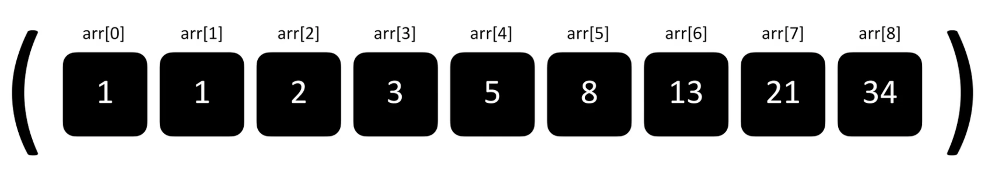
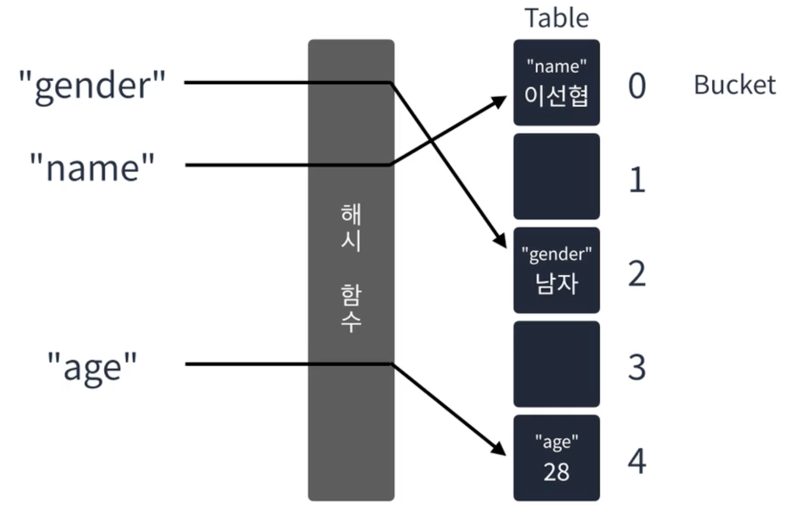
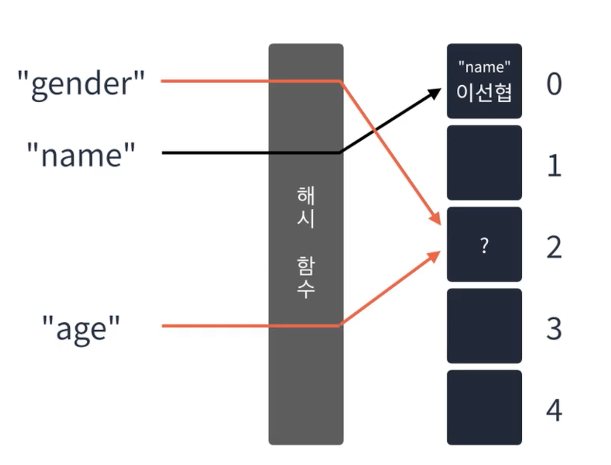
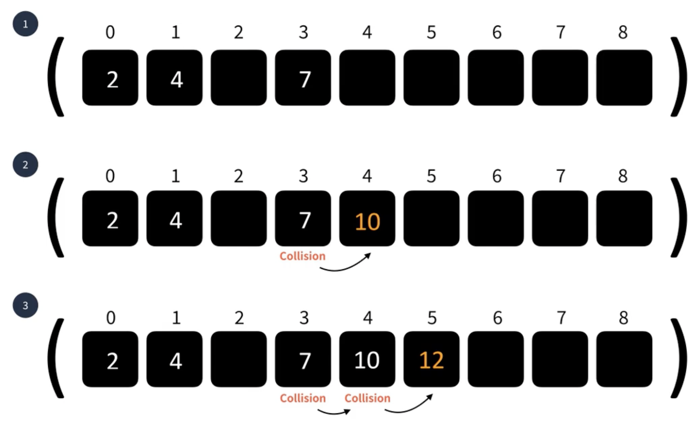
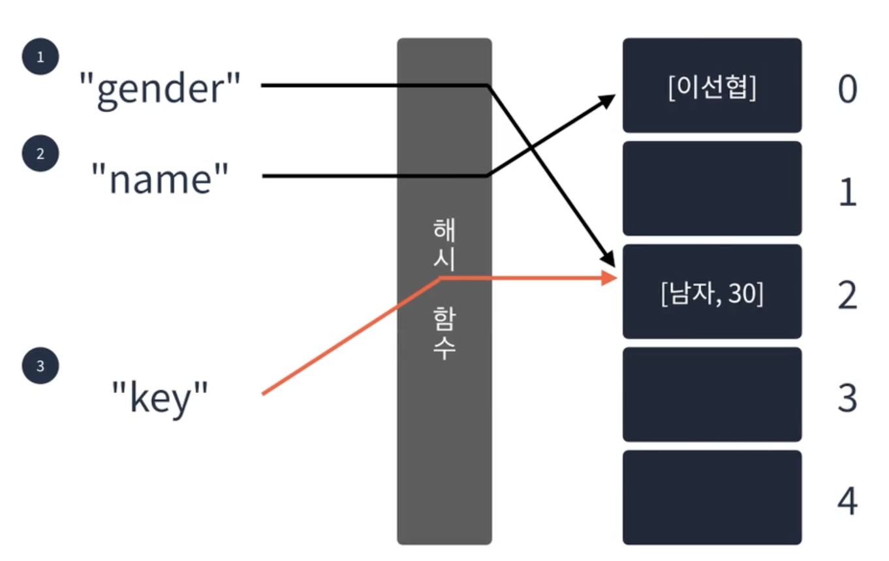
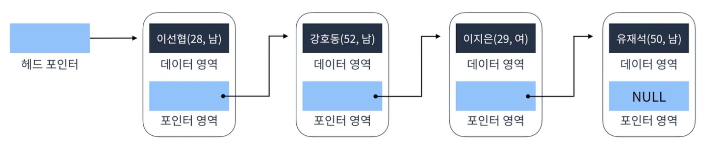
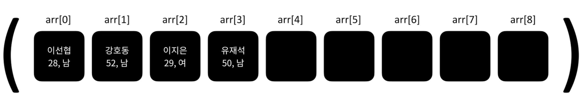

# 해시 테이블

해시 테이블은 한정된 배열 공간에 key를 index로 변환하여 값들을 넣게 됩니다. \
그렇다면 index는 어떻게 구하는 걸까요?\


## 해시 테이블이란?

키와 값을 받아 키를 해싱(Hashing)하여 나온 index에 값을 저장하는 선형 자료구조 삽입은 O(1)이며 키를 알고 있다면, 삭제, 탐색도 O(1)로 수행합니다.\


## 해시 함수란?

입력받은 값을 특정 범위 내 숫자로 변경하는 함수입니다. \
특정한 구현 방법이 정해져 있지는 않아서 규칙을 따로 만들면 됩니다.

## 해시 테이블의 문제점

만일 해시 함수의 결과가 동일하게 겹친다면 문제가 발생하는데 이를 **해시 충돌**이라고 부릅니다.\


## 해시 충돌 해결 방법

해시 충돌 해결 방법에는 대표적으로 4가지가 있습니다.

1. **선형 탐사법** \
   충돌이 발생하면 옆으로 한 칸 이동합니다. 단순하지만 특정 영역에 데이터가 몰릴 수 있다는 단점이 있으며, 이동한 버킷에서 또 충돌이 일어난다면 충돌이 일어나지 않을 때까지 이동합니다. 그래서 이름 그대로 최악의 경우 탐색에 선형 시간이 걸릴 수 있습니다.\
   
2. **제곱 탐사법** \
   ****그래서 특정 영역에 데이터가 몰리지 않게끔 제곱 탐사법을 사용할 수 있습니다. 제곱 탐사법은 충돌이 발생하면 충돌이 발생한 횟수의 제곱만큼 옆으로 이동합니다. 충돌이 발생할수록 범위가 커지기 때문에 데이터가 몰리는 것이 선형 탐사법보다 덜 합니다.\
   
3. **이중 해싱** \
   ****충돌이 발생하면 다른 해시 함수를 이용합니다.\
   
4. **분리 연결법** \
   버킷의 값을 연결 리스트로 사용하여 충돌이 발생하면 리스트에 값을 추가합니다. 대신 이 방법은 최악의 경우 하나의 버킷이 무한정 늘어날 수 있습니다.\
   

## 사용 예시

예를 들어 학생 정보를 관리한다고 했을 경우 **연결 리스트**를 사용하면 학생 정보가 알고 싶을 때 **O(n)의 시간복잡도**가 걸립니다. 학생 정보를 추가하거나 제거할 때에는 시간이 빠르지만 조회할 때에는 선형 시간만큼 시간이 걸립니다.\


**배열**을 사용할 수도 있지만 인덱스를 모를 경우 탐색에 **O(n)의 시간복잡도**가 걸립니다.\


반면 **해시 테이블**을 사용하면 **O(1)의 시간복잡도**가 걸리기 때문에 값을 빠르게 찾아야하는 경우 해시 테이블을 사용하는 것이 좋습니다.\
.png>)

## JavaScript 사용 예시

1.Array

```javascript
const table = [];
table["key"] = 100;
table["key2"] = "Hello";
console.log(table["key"]); // 100
table["key"] = 349;
console.log(table["key"]); // 349
delete table["key"];
console.log(table["key"]); // undefined
```

2.Object

```javascript
const table = {};
table["key"] = 100;
table["key2"] = "Hello";
console.log(table["key"]); // 100
table["key"] = 349;
console.log(table["key"]); // 349
delete table["key"];
console.log(table["key"]); // undefined
```

3.Map

```javascript
const table = new Map();
table.set("key", 100);
table.set("key2", "Hello");
console.log(table["key"]); undefined
console.log(table.get("key")); //100
const object = {a : 1};
table.set(object, "A1"); // Map은 Object도 Key로 쓸 수 있다.
console.log(table.get(object)); // A1
table.delete(object);
console.log(table.get(object)); // undefined
console.log(table.keys()); // {'key', 'key2'}
console.log(table.values()); // {100, 'Hello'}
table.clear();
console.log(table.values()); // { }
```

4.Set

```javascript
const table = new Set();
table.add("key"); // Key와 Value가 동일하게 들어간다.
table.add("key2");
console.log(table.has("key2")); // true
console.log(table.has("key3")); // false
table.delete("key2");
console.log(table.has("key2")); // false
table.add("key3");
console.log(table.size); // 2
table.clear();
console.log(table.size); // 0
```
