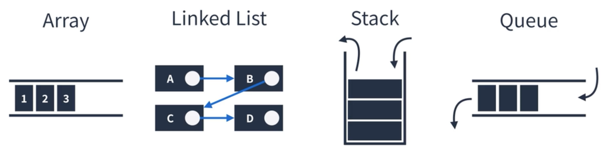
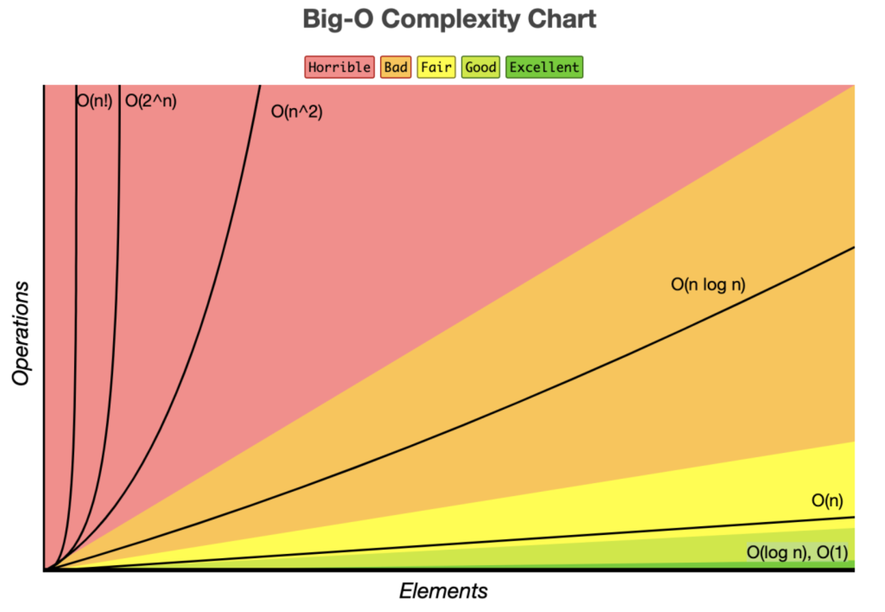

# 자료구조의 종류

## 자료구조

메모리를 효율적으로 사용하며 빠르고 안정적으로 데이터를 처리하는 것이 궁극적인 목표로 상황에 따라 유용하게 사용될 수 있도록 **특정 구조**를 이루고 있습니다.

## 자료구조의 종류

### 단순 구조

단순 구조에는 정수, 실수, 문자열, 논리 등으로 구성되어 있습니다.

### 선형 구조

한 원소 뒤에 하나의 원소만이 존재하는 형태로 자료들이 선형으로 나열되어 있는 구조를 가집니다.\
선형 구조에 해당되는 자료구조는 배열, 연결 리스트, 스택, 큐 등이 있습니다.\



### 비선형 구조

원소 간 다대다 관계를 가지는 구조로 계층적 구조나 망형 구조를 표현하기에 적절합니다.\ 비선형 구조에 해당되는 자료구조는 트리와 그래프 등이 있습니다.


## 시간복잡도

### 빅오표기법(Big-O Notation)



시간복잡도 순으로 빅오표기법의 종류를 나열하면 다음과 같습니다.
위에서부터 아래로 내려갈수록 복잡해집니다.

- O(1)
- O(log n)
- O(n)
- O(log n)
- O(n^2)
- O(2^n)

### O(n)

```javascript
for (let i = 0; i < n; i += 1) {
  // ...
}
```

### O(log n)

```javascript
for (let i = 1; i <= n; i *= 2) {
  // ...
}
```

### O(n log n)

```javascript
for (let i = 0; i < n; i += 1) {
  for (let j = 1; j <= n; j *= 2) {
    // ...
  }
}
```

### O(n^2)

```javascript
for (let i = 0; i < n; i += 1) {
  for (let j = 0; j < n; j += 1) {
    // ...
  }
}
```

### 기억해야할 점

1. 상수항은 무시

```javascript
// 계수 법칙에 의해 계수는 무시된다.
// 그리하여 O(n + m)으로 표기된다.
for (let i = 0; i < n * 6; i += 1) {
  // ...
}
for (let i = 0; i < m * 3; i += 1) {
  // ...
}
```

2. 가장 큰 항 외엔 무시

```javascript
for (let i = 0; i < n; i += 1) {
  // ...
}
for (let i = 0; i < n; i += 1) {
  for (let j = 0; j < n; j += 1) {
    // ...
  }
}
```

### 성능측정방법

```javascript
console.log('Start');
const start = new Date().getTime();
const N = 10000000;

let total = 0;
for (let i = 0; i < N; i += 1) {
  total += i;
}

const end = new Date().getTime();
console.log(end - start);
console.log('Finish');
```
