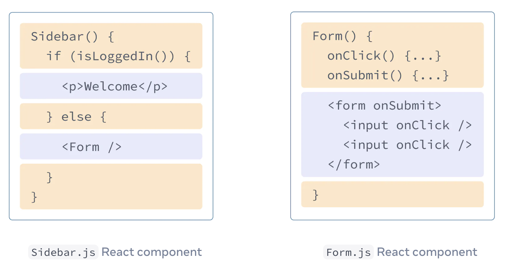

# JSX

## 강의노트

### JSX란?

[React Beta 문서](https://beta.reactjs.org/learn/writing-markup-with-jsx)에 따르면 `JSX`는 **자바스크립트 파일 안에 HTML과 유사한 마크업을 작성할 수 있게 해주는 자바스크립트용 구문 확장자**라고 합니다.

### React에서 JSX를 사용하는 이유

**JSX라는 구문 확장자를 통해 렌더링 로직과 마크업이 같은 위치의 React 컴포넌트에 함께 존재할 수 있게 합니다.**

웹은 HTML, CSS, JavaScript를 기반으로 구축되었습니다. 콘텐츠는 HTML 안에 마크업되고, 페이지 로직은 JavaScript 안에 별도로 존재했습니다. \
하지만 **웹이 더욱 인터랙티브해지면서 로직이 콘텐츠를 결정하는 비중이 점점 커졌고 자바스크립트가 HTML을 담당하게 되었습니다.** 이것이 바로 React에서 렌더링 로직과 마크업이 같은 위치의 컴포넌트에 함께 존재하는 이유입니다.

**각 React 컴포넌트**는 **React가 브라우저에 렌더링하는 일부 마크업을 포함할 수 있는 JavaScript 함수**입니다. React 컴포넌트는 **JSX라는 구문 확장자를 사용해 해당 마크업을 표현**합니다. JSX는 HTML과 매우 비슷해 보이지만 조금 더 엄격하고 동적 정보를 표시할 수 있습니다.

> JSX와 React는 별개의 개념입니다. 종종 함께 사용되기도 하지만 서로 독립적으로 사용할 수도 있습니다. JSX는 구문 확장이고 React는 자바스크립트 라이브러리입니다

 \
버튼의 **렌더링 로직과 마크업을 함께 유지하면 편집할 때마다 서로 동기화 상태를 유지할 수 있습니다.** \
반대로 버튼의 마크업과 사이드바의 마크업처럼 서로 관련이 없는 세부 사항은 서로 분리되어 있으므로 둘 중 하나만 개별적으로 변경하는 것이 더 안전합니다.

### JSX 사용 규칙

1. 단일 루트 요소 반환(Return a single root element) 컴포넌트에서 여러 요소를 반환하려면 **단일 부모 태그로 요소를 감싸야합니다.** 아래 예시는 `<div></div>` 태그로 감쌌지만, `<></>` [Fragment](https://beta.reactjs.org/reference/react/Fragment)를 사용해도 됩니다. Fragment를 사용하면 DOM 트리에 흔적을 남기지 않습니다.

```typescript
<div>
  <h1>Hedy Lamarr's Todos</h1>
  
  <ul>
    ...
  </ul>
</div>
```

> Q. JSX에서 여러 요소를 단일 부모 태그로 요소를 감싸는 이유 \
> A. JSX는 HTML처럼 보이지만 내부적으로는 일반 JavaScript 객체로 변환됩니다. \
> 함수에서 두 개의 객체를 배열로 래핑하지 않고는 반환할 수 없습니다. 이것이 바로 두 개의 JSX 태그를 다른 태그나 조각으로 래핑하지 않고 반환할 수 없는 이유를 설명합니다.

2. 태그는 반드시 닫아줍니다. JSX는 엄격하게 닫힌 태그를 사용합니다.

```typescript
<>
  
  <ul>
    <li>Invent new traffic lights</li>
    <li>Rehearse a movie scene</li>
    <li>Improve the spectrum technology</li>
  </ul>
</>
```

3. camelCase를 사용합니다. JSX는 자바스크립트로 바뀌고 JSX로 작성된 attributes는 자바스크립트 객체의 키가 됩니다. React에서는 많은 HTML과 SVG attributes를 대/소문자 구분 없이 camelCase로 작성합니다. class는 예약어이므로 React에서는 해당 DOM 프로퍼티의 이름을 딴 className을 대신 작성합니다.

```typescript
export default function TodoList() {
  return (
    <>
      <h1>Hedy Lamarr's Todos</h1>
      
      <ul>...</ul>
    </>
  );
}
```

### JSX와 중괄호(Curly Braces)

JSX를 사용하면 JavaScript 파일 안에 HTML과 유사한 마크업을 작성하여 렌더링 로직과 콘텐츠를 같은 위치에 유지할 수 있습니다. JSX 안에서 JavaScript를 사용할 때에는 \*\*중괄호 { }\*\*를 사용해야 합니다.

> 중괄호 { }는 JSX 태그 콘텐츠 내부 또는 속성의 = 바로 뒤에서 작동합니다. \{{ \}}는 특별한 구문이 아니라 JSX 중괄호 안에 들어 있는 JavaScript 객체입니다.

```javascript
export default function Avatar() {
  const avatar = 'https://i.imgur.com/7vQD0fPs.jpg';
  const name = 'Gregorio Y. Zara';
  return (
    <>
      <h1>{name}</h1>
      
      <ul
        style={{
          backgroundColor: 'black',
          color: 'pink',
        }}
      >
        <li>Improve the videophone</li>
        <li>Prepare aeronautics lectures</li>
        <li>Work on the alcohol-fuelled engine</li>
      </ul>
    </>
  );
}
```

### JSX와 React.createElement

[React 공식 문서](https://reactjs.org/docs/jsx-in-depth.html)에 따르면 JSX는 **React.createElement(component, props, ...children) 함수에** [**syntatic sugar**](https://en.wikipedia.org/wiki/Syntactic\_sugar)**을 제공할 뿐**이라고 합니다.

> syntactic sugar is syntax within a programming language that is designed to make things easier to read or to express.

[React.createElement](https://beta.reactjs.org/reference/react/createElement)는 React element를 생성할 수 있으며, JSX 대신에 사용할 수 있습니다. **JSX 코드는 자바스크립트 컴파일러인 @babel을 통해서 React.createElemet JS 코드로 변환됩니다.**

```javascript
const element = createElement(type, props, ...children);
```

### .ts vs .tsx

타입스크립트의 경우 `.ts`와 `.tsx` 확장자를 사용합니다. `.tsx`에서는 JSX를 사용할 수 있지만 `.ts`는 JSX 사용이 불가능 합니다. 반대로, JSX 코드는 JS 코드로 변환되기 때문에 `.js`와 `.jsx`확장자에서는 모두 JSX 사용이 가능하지만 JSX 코드는 엄밀히 말하면 표준 JavaScript가 아니기 때문에 `.js`에서 JSX 사용은 추천하지 않습니다.

*   예시 1.

    * JSX 코드

    ```javascript
    <p>Hello, world!</p>
    ```

    * 변환된 JS 코드

    ```javascript
    // JSX 태그의 첫 부분은 React 엘리먼트의 타입을 결정합니다.
    React.createElement('p', null, 'Hello, world!');
    ```
*   예시 2.

    * JSX 코드

    ```javascript
    <Greeting name='world' />
    ```

    * 변환된 JS 코드

    ```javascript
    //대문자로 표시된 유형은 JSX 태그가 React 컴포넌트를 참조하고 있음을 나타냅니다.
    React.createElement(Greeting, { name: 'world' });
    ```
* 예시 3.
  *   JSX 코드

      ```javascript
      <Button type='submit'>Send</Button>
      ```
  *   변환된 JS 코드

      ```javascript
      React.createElement(Button, { type: 'submit' }, 'Send');
      ```
* 예시 4.
  *   JSX 코드

      ```javascript
      <div className='test'>
        <p>Hello, world!</p>
        <Button type='submit'>Send</Button>
      </div>
      ```
  *   변환된 JS 코드

      ```javascript
      React.createElement(
        'div',
        { className: 'test' },
        React.createElement('p', null, 'Hello, world!'),
        React.createElement(Button, { type: 'submit' }, 'Send')
      );
      ```
* 예시 5.
  *   JSX 코드

      ```javascript
      <div>
        <p>Count: {count}!</p>
        <button type='button' onClick={() => setCount(count + 1)}>
          Increase
        </button>
      </div>
      ```
  *   변환된 JS 코드

      ```javascript
      React.createElement(
        'div',
        null,
        React.createElement('p', null, 'Count: ', count, '!'),
        React.createElement(
          'button',
          { type: 'button', onClick: () => setCount(count + 1) },
          'Increase'
        )
      );
      ```
