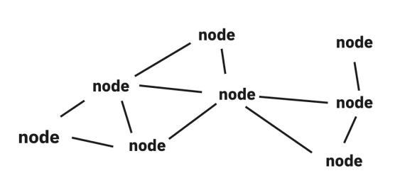
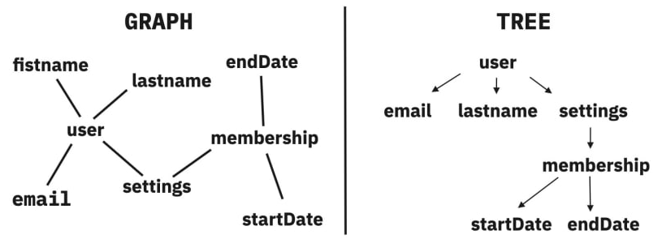
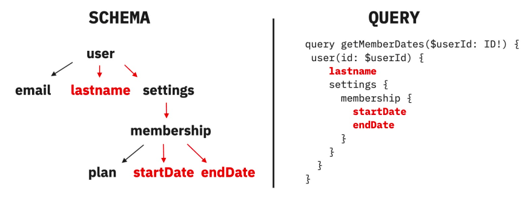
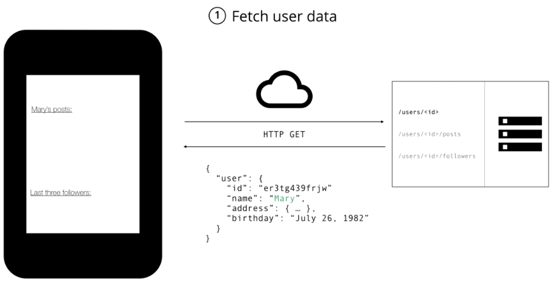
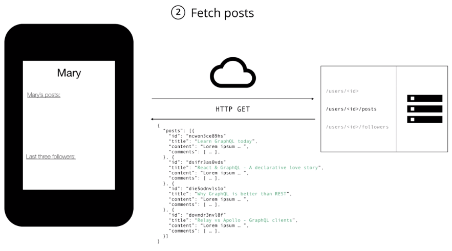
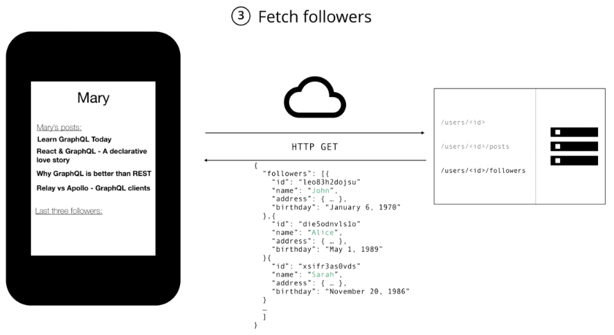
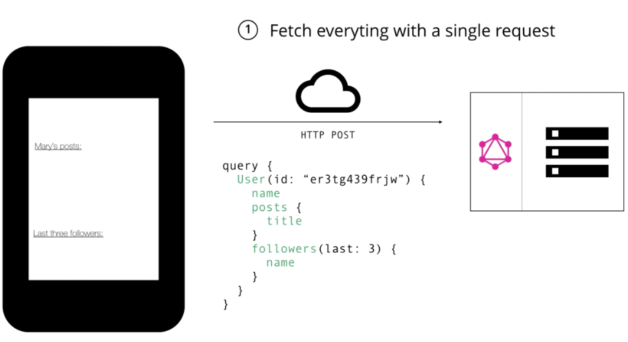

# React Component

## REST API와 GraphQL

### REST API란 무엇인가?

REST API의 REST는 `Representational State Transfer`의 약자로 REST API는 **웹에서 사용되는 데이터나 자원(Resource)을 HTTP URI로 표현하고, HTTP 프로토콜을 통해 요청과 응답을 정의하는 방식**을 의미합니다.

- CRUD(Create, Read, Update, Delete)와 HTTP 메서드 적용 규칙
  - `GET` 메서드는 **데이터를 조회(READ)**하기 위해서 사용합니다. `GET` 메서드를 사용하여 요청을 보내고, 이때 `GET` 메서드는 `body`를 가지지 않기 때문에 query parameter를 사용하여 필요한 리소스를 전달합니다. `GET`메서드는 서버의 데이터를 변화시키지 않는 요청에 사용해야 합니다.
  - `POST` 메서드는 **데이터를 추가(CREATE)**하기 위해서 사용합니다. `POST`메서드는 요청마다 새로운 리소스를 생성하고 `PUT` 메서드는 요청마다 같은 리소스를 반환합니다. 이렇게 매 요청마다 같은 리소스를 반환하는 특징을 `멱등` 하다고 합니다. 그렇기 때문에 멱등성을 가지는 `PUT`메서드와 그렇지 않은 `POST`메서드를 구분하여 사용해야 합니다.
  - `PUT` 메서드와 `PATCH`메서드는 데이터를 업데이트(UPDATE)하기 위해 사용합니다. `PUT` 메서드의 경우 리소스의 모든 것을 업데이트하고 `PATCH` 메서드는 리소스의 일부를 업데이트합니다. 따라서 `PUT` 메서드는 교체, `PATCH`메서드는 수정의 용도로 사용합니다.

### GraphQL은 왜 등장했는가?

GraphQL은 Graph + Query Language의 줄임말로 API를 위한 쿼리 언어입니다.

<figure><figcaption><p>그래()</p></figcaption></figure>

그래프(Graph)는 **여러 개의 점들이 서로 복잡하게 연결되어 있는 관계를 표현한 자료구조**를 뜻합니다. 하나의 점을 그래프에서는 **Node** 또는 **정점(vertex)**라고 표현하고, 하나의 선은 **간선(edge)** 이라고 합니다. **직접적인 관계**가 있는 경우 두 점 사이를 이어주는 선이 있으며, **간접적인 관계**라면 몇 개의 점과 선에 걸쳐 이어집니다.

<figure><figcaption></figcaption></figure>

GraphQL에서는 모든 데이터가 그래프 형태로 연결돼 있다고 전제합니다. 일대일로 연결된 관계도, 여러 계층으로 이루어진 관계도 모두 그래프입니다. 트리나 그래프나 노드와 노드를 연결하는 간선으로 구성된 자료구조이기 때문입니다. 단지 그 그래프를 누구의 입장에서 정렬하느냐(클라이언트가 어떤 데이터를 필요로 하느냐)에 따라 트리 구조를 이룰 수 있습니다.

<figure><figcaption></figcaption></figure>

이를 통해 GraphQL은 클라이언트 요청에 따라 유연하게 **트리 구조의 JSON 데이터를 응답으로 전송**할 수 있습니다. 다시 말해 GraphQL은 REST API 방식의 고정된 자원이 아닌 **클라이언트 요청에 따라 유연하게 자원을 가져올 수 있다는 점**에서 엄청난 이점을 갖습니다.

- **GraphQL의 특징**
  - GraphQL은 HTTP를 통해 API 서버로 요청을 보내고 응답을 받습니다.
  - 응답을 받을 시, 데이터 결과를 JSON 형식으로 받습니다.
  - GraphQL은 서버 개발자가 작성한 각 필드에 대응하는 resolver 함수로 각 필드의 데이터를 조회할 수 있습니다.
  - GraphQL은 GraphQL 라이브러리가 조회 대상 schema가 유효한지 검사합니다.

### REST API vs GraphQL

- **REST API의 한계**

  1.  **Overfetch: 필요 없는 데이터까지 제공함** \
      아래 이미지에서처럼 유저의 이름만 필요한 상황에서 REST API를 사용한다면, 응답 데이터에는 유저의 주소, 생일 등과 같이 실제로는 클라이언트에게 필요없는 정보가 포함돼 있을 수 있습니다.&#x20;

      <figure><figcaption></figcaption></figure>

  2.  **Underfetch: endpoint가 필요한 정보를 충분히 제공하지 못함** \
      아래 이미지에서처럼 REST API에서는 각각의 자원에 따라 엔드포인트를 구분하기 때문에 클라이언트는 필요한 정보를 모두 확보하기 위해서 추가적인 요청을 보내야만 합니다. &#x20;

      <figure><figcaption></figcaption></figure>

      <figure><figcaption></figcaption></figure>

- **REST API와 GraphQL의 다른점**

  1. **하나의 endpoint 요청**\
     \*\*\*\*하나의 endpoint로 요청을 받고 그 요청에 따라 query, mutaion을 resolver 함수로 전달해서 요청에 응답합니다. 모든 클라이언트 요청은 `POST` 메소드를 사용합니다.&#x20;
  2. **NO! under & overfetching**\
     \*\*\*\*여러 개의 endpoint 요청을 할 필요없이 하나의 endpoint에서 쿼리를 이용해 원하는 데이터를 정확하게 API에 요청하고 응답으로 받을 수 있습니다.
  3. REST API는 URI가 Resource를 나타내고 Method가 작업의 유형을 나타내지만, GraphQL에서는 GraphQL Schema가 Resource를 나타내고 Query, Mutation 타입이 작업의 유형을 나타냅니다.

  <figure><figcaption></figcaption></figure>

## [JSON으로 작업하기](https://developer.mozilla.org/ko/docs/Learn/JavaScript/Objects/JSON)

JSON은 JavaScript Object Notation의 약어로 Javascript 객체 문법으로 구조화된 데이터를 표현하기 위한 문자 기반의 표준 포맷입니다. 웹 어플리케이션에서 데이터를 전송할 때 일반적으로 사용합니다.

### 객체와 문자 사이의 변환

- [parse()](https://developer.mozilla.org/en-US/docs/Web/JavaScript/Reference/Global_Objects/JSON/parse) : JSON 문자열을 구문 분석하여 문자열이 설명하는 JavaScript 값 또는 객체를 구성합니다.
- [stringify()](https://developer.mozilla.org/en-US/docs/Web/JavaScript/Reference/Global_Objects/JSON/stringify): 자바스크립트 값을 JSON 문자열로 변환합니다.

## [명령형 프로그래밍](https://ko.wikipedia.org/wiki/%EB%AA%85%EB%A0%B9%ED%98%95_%ED%94%84%EB%A1%9C%EA%B7%B8%EB%9E%98%EB%B0%8D) vs [선언형 프로그래밍](https://ko.wikipedia.org/wiki/%EC%84%A0%EC%96%B8%ED%98%95_%ED%94%84%EB%A1%9C%EA%B7%B8%EB%9E%98%EB%B0%8D)

명령형 프로그램은 알고리즘(How)을 명시하고 목표는 명시하지 않는 데 반해 \
선언형 프로그램은 목표(What)를 명시하고 알고리즘을 명시하지 않습니다

## Thinking in React

[Thinking in React](https://react.dev/learn/thinking-in-react)의 **Start with the mockup**에서는 다음과 같은 mockup과 JSON API가 나옵니다.

- mockup .png>)
- JSON API

```json
[
  { "category": "Fruits", "price": "$1", "stocked": true, "name": "Apple" },
  {
    "category": "Fruits",
    "price": "$1",
    "stocked": true,
    "name": "Dragonfruit"
  },
  {
    "category": "Fruits",
    "price": "$2",
    "stocked": false,
    "name": "Passionfruit"
  },
  {
    "category": "Vegetables",
    "price": "$2",
    "stocked": true,
    "name": "Spinach"
  },
  {
    "category": "Vegetables",
    "price": "$4",
    "stocked": false,
    "name": "Pumpkin"
  },
  { "category": "Vegetables", "price": "$1", "stocked": true, "name": "Peas" }
]
```

### Step 1: Break the UI into a component hierarchy

.png>)

1. mockup의 모든 컴포넌트와 하위 컴포넌트 주위에 상자를 그리고 이름을 지정합니다. 만약 디자이너와 함께 작업한다면 이미 컴포넌트 이름이 지정된 경우가 많습니다.

```typescript
type Product = {
  category: string;
  price: string;
  stocked: boolean;
  name: string;
};

const products: Product[] = [
  { category: 'Fruits', price: '$1', stocked: true, name: 'Apple' },
  { category: 'Fruits', price: '$1', stocked: true, name: 'Dragonfruit' },
  { category: 'Fruits', price: '$2', stocked: false, name: 'Passionfruit' },
  { category: 'Vegetables', price: '$2', stocked: true, name: 'Spinach' },
  { category: 'Vegetables', price: '$4', stocked: false, name: 'Pumpkin' },
  { category: 'Vegetables', price: '$1', stocked: true, name: 'Peas' },
];

export default function App() {
  const categories = products.reduce(
    (acc: string[], product: Product) =>
      acc.includes(product.category) ? acc : [...acc, product.category],
    []
  );

  return (
    <div className="filterable-product-table">
      <div className="search-bar">
        <div>
          <input type="text" placeholder="Search..." />
        </div>
        <div>
          <input type="checkbox" id="only-stock" />
          <label htmlFor="only-stock">Only show products in stock</label>
        </div>
      </div>
      <table className="product-table">
        <thead>
          <tr>
            <th>Name</th>
            <th>Price</th>
          </tr>
        </thead>
        <tbody>
          <tr>
            <th colSpan={2}>{categories[0]}</th>
          </tr>
          {products
            .filter((product) => product.category === categories[0])
            .map((product) => (
              <tr key={product.name}>
                <td>{product.name}</td>
                <td>{product.price}</td>
              </tr>
            ))}
          <tr>
            <th colSpan={2}>{categories[1]}</th>
          </tr>
          {products
            .filter((product) => product.category === categories[1])
            .map((product) => (
              <tr key={product.name}>
                <td>{product.name}</td>
                <td>{product.price}</td>
              </tr>
            ))}
        </tbody>
      </table>
    </div>
  );
}
```

1-1.[Extract Function](https://refactoring.com/catalog/extractFunction.html) 일단 길게 코드를 작성하고, 적절히 자를 수 있는 부분이 보일 때 **함수로 추출**합니다.

- App.tsx

```typescript
import ProductsInCategory from './component/ProductsInCategory';
// import type은 한 칸 아래로 띄어줘서 보기 쉽게 관리합니다.
import type Product from './types/Product';

const products: Product[] = [
  { category: 'Fruits', price: '$1', stocked: true, name: 'Apple' },
  { category: 'Fruits', price: '$1', stocked: true, name: 'Dragonfruit' },
  { category: 'Fruits', price: '$2', stocked: false, name: 'Passionfruit' },
  { category: 'Vegetables', price: '$2', stocked: true, name: 'Spinach' },
  { category: 'Vegetables', price: '$4', stocked: false, name: 'Pumpkin' },
  { category: 'Vegetables', price: '$1', stocked: true, name: 'Peas' },
];

export default function App() {
  const categories = products.reduce(
    (acc: string[], product: Product) =>
      acc.includes(product.category) ? acc : [...acc, product.category],
    []
  );

  return (
    <div className="filterable-product-table">
      <div className="search-bar">
        <div>
          <input type="text" placeholder="Search..." />
        </div>
        <div>
          <input type="checkbox" id="only-stock" />
          <label htmlFor="only-stock">Only show products in stock</label>
        </div>
      </div>
      <table className="product-table">
        <thead>
          <tr>
            <th>Name</th>
            <th>Price</th>
          </tr>
        </thead>
        <tbody>
          {categories.map((category) => (
            <ProductsInCategory
              key={category}
              category={category}
              products={products}
            />
          ))}
        </tbody>
      </table>
    </div>
  );
}
```

- components/ProductsCategory.tsx

```typescript
import type Product from '../types/Product';

type ProductsInCategoryProps = {
  category: string;
  products: Product[];
};

export default function ProductsInCategory({
  category,
  products,
}: ProductsInCategoryProps) {
  const productInCategory = products.filter(
    (product) => product.category === category
  );
  return (
    <>
      <tr>
        <th colSpan={2}>{category}</th>
      </tr>
      {productInCategory.map((product) => (
        <tr key={product.name}>
          <td>{product.name}</td>
          <td>{product.price}</td>
        </tr>
      ))}
    </>
  );
}
```

1-2. Design’s Layer JSON이 잘 구조화되어 있으면 UI의 컴포넌트 구조에 자연스럽게 매핑되는 것을 종종 발견할 수 있습니다. 이는 UI와 데이터 모델이 동일한 정보 아키텍처, 즉 동일한 형태를 가지고 있는 경우가 많기 때문입니다. 따라서 UI를 컴포넌트로 분리하면 각 컴포넌트가 데이터 모델의 한 부분과 일치하다는 것을 알 수 있습니다.

- App.tsx

```typescript
import FilterableProductTable from './component/FilterableProductTable';

import type Product from './types/Product';

const products: Product[] = [
  { category: 'Fruits', price: '$1', stocked: true, name: 'Apple' },
  { category: 'Fruits', price: '$1', stocked: true, name: 'Dragonfruit' },
  { category: 'Fruits', price: '$2', stocked: false, name: 'Passionfruit' },
  { category: 'Vegetables', price: '$2', stocked: true, name: 'Spinach' },
  { category: 'Vegetables', price: '$4', stocked: false, name: 'Pumpkin' },
  { category: 'Vegetables', price: '$1', stocked: true, name: 'Peas' },
];

export default function App() {
  return <FilterableProductTable products={products} />;
}
```

- components/FilterableProductTable.tsx

```typescript
import ProductTable from './ProductTable';
import SearchBar from './SearchBar';

import type Product from '../types/Product';

type FilterableProductTableProps = {
  products: Product[];
};

export default function FilterableProductTable({
  products,
}: FilterableProductTableProps) {
  return (
    <div className="filterable-product-table">
      <SearchBar />
      <ProductTable products={products} />
    </div>
  );
}
```

- components/SearchBar.tsx

```typescript
export default function SearchBar() {
  return (
    <div className="search-bar">
      <div>
        <input type="text" placeholder="Search..." />
      </div>
      <div>
        <CheckBoxField label="Only show products in stock" />
      </div>
    </div>
  );
}
```

- components/CheckBoxField.tsx

```typescript
export default function CheckBoxField({ label }: { label: string }) {
  const id = useRef(`checkbox-${label}`.replace(/ /g, '-').toLowerCase());
  return (
    <>
      <input type="checkbox" id={id.current} />
      <label htmlFor={id.current}>{label}</label>
    </>
  );
}
```

- components/ProductTable.tsx [Inline Function](https://refactoring.com/catalog/inlineFunction.html)을 사용할 수 있습니다.

```typescript
import ProductsInCategory from './ProductsInCategory';

import selectCategories from '../utils/selectCategories';

import type Product from '../types/Product';

type ProductTableProps = {
  products: Product[];
};

export default function ProductTable({ products }: ProductTableProps) {
  const categories = selectCategories(products);
  return (
    <table className="product-table">
      <thead>
        <tr>
          <th>Name</th>
          <th>Price</th>
        </tr>
      </thead>
      <tbody>
        {categories.map((category) => (
          <ProductsInCategory
            key={category}
            category={category}
            products={products}
          />
        ))}
      </tbody>
    </table>
  );
}
```

- utils/selectCategories.ts

```typescript
import type Product from '../types/Product';

export default function selectCategories(products: Product[]): string[] {
  return products.reduce((acc: string[], product: Product) => {
    const { category } = product;
    return acc.includes(category) ? acc : [...acc, category];
  }, []);
}
```

- component/ProductsInCategory.tsx [Inline Function](https://refactoring.com/catalog/inlineFunction.html)을 사용할 수 있습니다.

```typescript
import ProductCategoryRow from './ProductCategoryRow';
import ProductRow from './ProductRow';
import selectProducts from '../utils/selectProducts';

import type Product from '../types/Product';

type ProductsInCategoryProps = {
  category: string;
  products: Product[];
};

export default function ProductsInCategory({
  category,
  products,
}: ProductsInCategoryProps) {
  const productInCategory = selectProducts(products, category);
  return (
    <>
      <ProductCategoryRow category={category} />
      {productInCategory.map((product) => (
        <ProductRow key={product.name} product={product} />
      ))}
    </>
  );
}
```

- utils/selectProducts.ts

```typescript
import type Product from '../types/Product';

export default function selectProducts(
  items: Product[],
  category: string
): Product[] {
  return items.filter((item) => item.category === category);
}
```

- component/ProductCategoryRow.tsx

```typescript
export default function ProductCategoryRow({ category }: { category: string }) {
  return (
    <tr>
      <th colSpan={2}>{category}</th>
    </tr>
  );
}
```

- component/ProductRow.tsx

```typescript
import type Product from '../types/Product';

type ProductRowProps = {
  product: Product;
};

export default function ProductRow({ product }: ProductRowProps) {
  return (
    <tr>
      <th>{product.name}</th>
      <th>{product.price}</th>
    </tr>
  );
}
```
