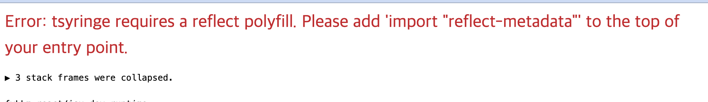
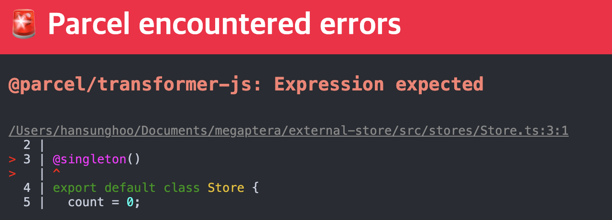

# TSyringe

## [TSyringe](https://github.com/microsoft/tsyringe)
TypeScript용 DI 도구(IoC Container)로써 External Store를 관리하는 데 활용할 수 있습니다.\
React 컴포넌트 입장에서는 "전역"처럼 여겨지고 "Prop Drilling" 문제를 우아하게 해결할 수 있는 방법 중 하나입니다.

### 의존성 주입(Dependency Injection)
- [의존관계 주입(Dependency Injection) 쉽게 이해하기](https://tecoble.techcourse.co.kr/post/2021-04-27-dependency-injection/)
- [[DI] DI Container, IOC Container 개념과 예제](https://eunjin3786.tistory.com/233)

### [reflect-metadata](https://github.com/rbuckton/reflect-metadata)
reflect-metadata는 Reflect API에 대한 [polyfill](https://developer.mozilla.org/ko/docs/Glossary/Polyfill) 입니다.
polyfill에는 여러 가지가 있지만 TSyringe에서는 reflect-metadata 사용을 권장합니다.

- 의존성 설치

```bash
npm i tsyringe reflect-metadata
```

- src/main.tsx 파일과 src/setupTests.ts 파일에서 reflect-metadata 임포트.
reflect-metadata 임포트를 안했을때 발생하는 오류입니다.


```typescript
import 'reflect-metadata';
```

- 싱글톤으로 관리할 CounterStore 클래스를 준비
```typescript
import { singleton } from 'tsyringe';

@singleton()
class CounterStore {
	// …(중략)...
}
```
  - 에제 코드 CounterStore.ts
```typescript
import { singleton } from "tsyringe";

type Listener = () => void;

// singleton이라는 건 전역에서 하나라는 뜻
@singleton()
export default class CounterStore {
  count = 0;

  listeners = new Set<Listener>()

  increase() {
    this.count += 1;
    this.public();
  }
  decrease() {
    this.count += 1;
    this.public();
  }

  public() {
    this.listeners.forEach((listener) => listener())
  }

  addListner(listener: Listener) {
    this.listeners.add(listener)
  }

  removeListner(listener: Listener) {
    this.listeners.delete(listener)
  }
}
```

- 싱글톤 CounterStore 객체를 사용
```typescript
import { container } from 'tsyringe';

const counterStore = container.resolve(CounterStore);
```

  - 예제 코드 useCounterStore.ts
```typescript
  import { useEffect } from "react";
import { container } from "tsyringe";
import CounterStore from "../stores/CounterStore";
import useForceUpdate from "./useForceUpdate";

export default function useCounterStore() {
  const store = container.resolve(CounterStore)

  const forceUpdate = useForceUpdate();

  useEffect(() => {
    store.addListner(forceUpdate)
    return () => {
      store.removeListner(forceUpdate)
    }
  }, [store, forceUpdate])

  return store
}
  ```
  - 예제 코드 Counter.tsx

```typescript
import useCounterStore from "../hooks/useCounterStore";

export default function Counter() {
  const store = useCounterStore()

  return (
    <>
    <div>
      <p>Count: {store.count}</p>
    </div>
    </>
  )
}
  ```
  - 예제코드 CountControl.tsx

```typescript
import useCounterStore from "../hooks/useCounterStore";

export default function CountControl(){
  const store = useCounterStore();

  const handleClickIncrease = () => {
  store.increase()
  }
  const handleClickDecrease = () => {
  store.decrease()
  }

  return (
    <>
    <div>
      <p>{store.count}</p>
      <button type="button" onClick={handleClickIncrease}>Increase</button>
      <button type="button" onClick={handleClickDecrease}>Decrease</button>
    </div>
    </>
  )
}
```

### [sington(싱글톤)](https://ko.wikipedia.org/wiki/%EC%8B%B1%EA%B8%80%ED%84%B4_%ED%8C%A8%ED%84%B4)
[tsconfig.json](https://www.typescriptlang.org/ko/docs/handbook/decorators.html)에서 아래 주석을 풀어줘야 에러를 해결할 수 있습니다.

```json
"experimentalDecorators": true,
"emitDecoratorMetadata": true
```



## 참고 자료
- [싱글톤 패턴(Singleton pattern)](https://gyoogle.dev/blog/design-pattern/Singleton%20Pattern.html)